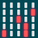
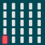
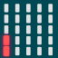
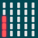

> Diese Seite bei [https://calliope-net.github.io/fernsteuerung-cb2-e41/](https://calliope-net.github.io/fernsteuerung-cb2-e41/) öffnen.

### Bedienung Calli:bot 2 ohne Fernbedienung

* nach dem Einschalten wird die Funkgruppe, Typ und Batterie Spannung angezeigt
* Beispiel 1: Funkgruppe 1; Typ 4 (Calli:bot 2 ohne Encoder); 3,8 Volt
* Beispiel 2: Funkgruppe 3; Typ 3 (Calli:bot 2 E mit Encoder); 4,5 Volt

 

* nur wenn B aus ist: **A geklickt**
  * schaltet *Hindernis ausweichen* an und aus (Ultraschall Sensor)
  * Calli:bot fährt geradeaus und lenkt vor einem Hindernis rückwärts
* nur wenn A aus ist: **B geklickt**
  * schaltet *Spur folgen* an und aus (2 Spur Sensoren)
  * fährt bis zu einer schwarzen Linie (etwa 2 cm breit) dann auf der Linie
  * mit A kann Ultraschall Sensor dazu geschaltet werden (gelbe LED)
  * hält dann auf der Line bei Hindernis an (wenn mehrere Calli:bot fahren)
* **A+B geklickt**
  * fährt 6 Strecken (mit Encoder zentimetergenau)
  * wenn A und B aus war: Ultraschall Sensor nicht aktiv
  * wenn *Hindernis ausweichen* gestartet war: Ultraschall Sensor aktiv
    * bei Hindernis Abbruch und weiter mit der nächsten Strecke
  * endet, wenn alle Strecken gefahren sind; kann nur mit Reset unterbrochen werden
  * Strecken können mit Blöcken selbst programmiert werden
  * die Länge wird mit Encoder in cm und ohne Encoder in Zehntelsekunden angegeben
  1. nach rechts fahren und lenken
  2. die selbe Strecke zurück
  3. geradeaus
  4. Kreis nach links
  5. Kreis nach rechts
  6. gerade zurück
* **RGB-LED** (Calliope)
  * rot blinken: keine Bluetooth Verbindung
  * grün: lokales Programm gestartet mit **A geklickt** **B geklickt** **A+B geklickt**
  * blau blinken: Fernbedienung mit gleicher Funkgruppe verbunden
* **Timeout**
  * rot blinken: nach 30 Sekunden *zurücksetzen*
  * grün: nach 30 Sekunden ohne Sensor-Ereignis *zurücksetzen*
  * blau blinken: kein Timeout (Calli:bot ist ferngesteuert)
  * aus schalten per Software wird beim Calli:bot nicht unterstützt
  * *zurücksetzen* kann auch von der Fernbedienung gesendet werden

> Timeout sorgt dafür, dass Calli:bot stehen bleibt wenn beim fernsteuern die Bluetooth Verbindung unterbrochen ist
> oder wenn er beim alleine fahren stecken bleibt.

### Bedienung Calli:bot 2 mit Fernbedienung

> Bei Sender und Empfänger muss die selbe Funkgruppe eingestellt sein.

Das Ändern der Funkgruppe funktioniert beim Calli:bot und der Fernbedienung gleich mit lange Drücken (etwa 4 Sekunden).
Die Funkgruppe wird im Flash gespeichert und beim nächsten Einschalten oder Reset wieder hergestellt. 

* **Funkgruppe 1-8** ist die Anzahl der roten LED in den 2 linken Spalten im Display
  *  **A halten** (-1)
  *  **B halten** (+1)

       

Beim Sender kann **nach** der Funkgruppe das Modell geändert werden, welches mit der Fernbedienung gesteuert werden soll.
Das Modell wird als Bild angezeigt. 

    

Calli:Bot ist das erste Bild. Das Modell und die Funkgruppe werden beim Einschalten der Fernbedienung (Sender) angezeigt.
Wird nicht das Calli:bot Bild angezeigt, kann es mit **A geklickt** (kurz drücken) wieder eingestellt werden.

> Sind mehrere Fernbedienungen im Einsatz, reagiert ein Calli:bot immer nur auf die Fernbedienung, die zuerst da war.
> (Von der das erste Bluetooth Datenpaket empfangen wurde. Nach Reset wird neu entschieden.)

* **A+B geklickt** startet die Bluetooth Funkverbindung. Calli:Bot blinkt blau.
* jetzt kann mit dem Joystick ferngesteuert werden *Funktion Fahren und lenken*
  * **A geklickt** schaltet Ultraschall Sensor an und aus (gelbe LED links)
  * **B geklickt** schaltet Spur Sensor an und aus (weiße LEDs)
  * **auf den Joystick drücken** hupen (nur wenn Hupe an Calli:Bot angebaut ist)

* **A+B geklickt** schaltet auf die nächste *Funktion Programm fenstarten*
  * **A geklickt** schaltet *Hindernis ausweichen* an und aus
  * **B geklickt** schaltet *Spur folgen* an und aus
  * funktioniert wie oben beschrieben, nur mit der Fernbedienung
  * laufendes Programm kann jederzeit mit der Fernbedienung unterbrochen werden
  * so kann Calli:Bot befreit werden, wenn er stecken geblieben ist, ohne ihn anzufassen

* **A+B geklickt** schaltet auf die nächste *Fahren Strecke*
  * **A geklickt** fährt 5 Strecken wie oben ohne 2. Kreis
    * mit Fernsteuerung können nur 5 Strecken zusammen übertragen werden
  * **B geklickt** fährt geradeaus und viertel Drehung 8 mal hintereinander
    * mit drehen auf der Stelle soll ein Quadrat zweimal gefahren werden
    * drehen nach Zeit ist ungenau und von der Batterie Spannung abhängig
    * genauer geht das mit Encoder, der 450 Impulse pro Rad Umdrehung zählt
  * *Fahren Strecke* kann nicht mit der Fernbedienung unterbrochen werden (LED grün)
  * Strecken können mit Blöcken selbst geändert werden (beim Sender)

* **A+B geklickt** schaltet zurück auf *Funktion Fahren und lenken*
  * dabei wird zur Kontrolle kurz das Modell Bild angezeigt
  * jetzt kann wieder mit dem Joystick ferngesteuert werden

* **A+B halten** sendet Reset zum Calli:bot und seinem Calliope
  * die Fernsteuerung ist wieder bei der Auswahl des Modells (Bilder)

## Dieses Projekt bearbeiten 

Um dieses Repository in MakeCode zu bearbeiten.

* öffne [https://makecode.calliope.cc/](https://makecode.calliope.cc/)
* klicke auf **Importieren** und dann auf **Importiere URL**
* füge **calliope-net/fernsteuerung-cb2-e41** ein und klicke auf Importieren

## Blocks preview

This image shows the blocks code from the last commit in master.
This image may take a few minutes to refresh.

